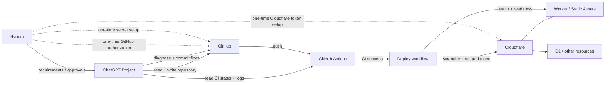
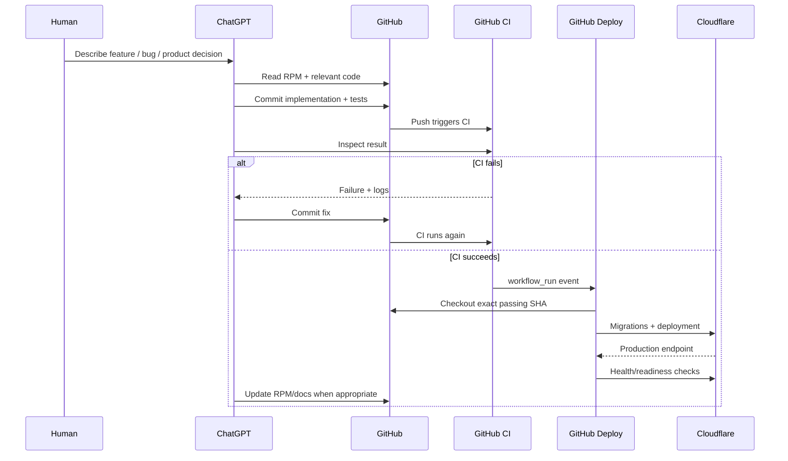

# AI-Native Repository Delivery

## ChatGPT + GitHub + Cloudflare Zero-Local Development Playbook

> A reusable operating model for building, testing, deploying, and maintaining a web application from a ChatGPT Project without requiring a local checkout or local development environment.

## 1. The concept

**AI-Native Repository Delivery (ANRD)** is a development model in which the repository and its automation become the primary execution environment for an AI developer.

The human supplies intent, product judgment, account ownership, and security approvals. ChatGPT operates the repository. GitHub stores durable state and executes CI/CD. Cloudflare runs production.

The shortest form is:

```text
Human intent
    ↓
ChatGPT Project + repository memory
    ↓
GitHub repository
    ↓
GitHub Actions
    ↓
Cloudflare
```

This is different from using ChatGPT as a code generator that feeds a local editor. In ANRD, the laptop is optional. The repository, automation, and cloud runtime are the working environment.

**Zero-local development** is the implementation property: no clone, editor, local terminal, package installation, git command, Wrangler command, or local build is required from the human.

**AI-Native Repository Delivery** is the broader operating model: repository-native memory, direct repository manipulation, CI-gated delivery, automated cloud provisioning, production verification, and failure recovery are all part of one closed loop.

## 2. What the workflow optimizes for

The target experience is:

- the human creates a ChatGPT Project and an empty GitHub repository;
- ChatGPT treats GitHub as the canonical project filesystem and durable source of truth;
- ChatGPT writes code, tests, workflows, migrations, documentation, and project memory directly to GitHub;
- GitHub Actions provides the reproducible build, test, and deployment environment;
- Cloudflare provides the production runtime and stateful services such as Workers and D1;
- the human performs only one-time trust-boundary operations that should remain account-owner controlled;
- after bootstrap, normal code changes can be tested and deployed without a local checkout and without a manual release click.

## 3. Architecture



## 4. Responsibility boundary

The cleanest rule is:

> **The human handles trust boundaries; ChatGPT handles implementation.**

### Human-controlled bootstrap actions

These remain human actions because they involve account ownership, authorization, billing, or secret material:

1. Create a ChatGPT Project.
2. Enable **project-only memory** when project isolation is desired.
3. Add persistent Project Instructions.
4. Create an empty GitHub repository.
5. Connect/authorize GitHub for ChatGPT.
6. Create a least-privilege Cloudflare API token.
7. Add Cloudflare credentials to GitHub Actions Secrets.
8. Configure custom domains, billing, external provider consoles, or other account-level settings when required.

Secrets should never be pasted into the conversation.

### ChatGPT-owned work

Once GitHub access exists, ChatGPT can own essentially the entire software lifecycle:

- initialize the repository;
- scaffold the application;
- choose and document architecture;
- create and edit source files;
- add dependencies;
- write tests;
- add database migrations;
- write Worker/server code;
- create CI workflows;
- create deployment workflows;
- inspect Actions runs and logs;
- diagnose failures;
- commit fixes;
- maintain repository project memory;
- provision supported cloud resources through CI/CD;
- verify production health;
- continue iteration without requiring a local checkout.

### GitHub's role

GitHub is not merely source control. In this model it is:

- the canonical project filesystem;
- the durable project history;
- the project-memory store;
- the CI execution environment;
- the deployment orchestrator;
- the secret store for deployment credentials;
- the event source for automatic delivery.

### Cloudflare's role

Cloudflare is the production substrate:

- Workers execute server logic;
- Workers Static Assets serve the frontend;
- D1 stores relational state;
- additional Cloudflare resources can be provisioned as needed;
- Wrangler runs inside GitHub Actions rather than on the user's laptop.

## 5. Repository Project Memory (RPM)

Chat is working memory. The repository should hold durable project state.

A minimal structure:

```text
.chatgpt/
├── project-memory.yaml
├── state.yaml
├── next-steps.md
└── decisions.md
```

Example manifest:

```yaml
version: 1
project:
  name: my-project
  repository: owner/my-project
canonical_source: github
files:
  state: .chatgpt/state.yaml
  next_steps: .chatgpt/next-steps.md
  decisions: .chatgpt/decisions.md
checkpoint:
  triggers:
    - checkpoint
    - save progress
    - 结束
    - 收尾
```

Project Instructions should tell ChatGPT to read the manifest and referenced files at the first substantive turn of each new conversation, and to checkpoint repository state when requested.

This makes the repository—not any individual conversation—the durable project brain.

## 6. Standard bootstrap

### Phase A — Create the control plane

Human:

1. Create a ChatGPT Project.
2. Enable project-only memory if desired.
3. Add repository-first/RPM Instructions.
4. Create an empty GitHub repository.
5. Authorize ChatGPT to access it.

No local clone is required.

### Phase B — Initialize the repository

ChatGPT:

1. initializes RPM;
2. scaffolds the application;
3. records architecture and decisions;
4. adds tests and CI;
5. adds Cloudflare configuration;
6. adds migrations and deployment automation;
7. commits everything directly to GitHub;
8. monitors CI and fixes repository-side failures until green.

### Phase C — Establish the production trust boundary

For a Workers + D1 application, a typical Cloudflare token needs only the project-relevant permissions, for example:

- Workers Scripts: Write/Edit
- D1: Write/Edit

GitHub Actions Secrets:

```text
CF_API_TOKEN
CF_ACCOUNT_ID
```

Application-specific services may add more secrets, but only when actually necessary.

### Phase D — Bootstrap production

The first deployment should be capable of:

1. validating required secrets;
2. installing dependencies;
3. running tests;
4. building production assets;
5. discovering or provisioning D1;
6. injecting runtime resource IDs into a runner-only configuration;
7. applying migrations;
8. deploying Worker and assets;
9. discovering the actual production URL;
10. calling `/api/health` and `/api/ready`;
11. failing loudly when production is unhealthy.

The deployment must be **idempotent**. Re-running it should reuse resources rather than create duplicates.

## 7. Normal development loop



The laptop does not participate in the normal loop.

## 8. Deployment maturity modes

### Mode 1 — Manual production trigger

Useful while infrastructure is still being bootstrapped:

```yaml
on:
  workflow_dispatch:
```

Advantages:

- explicit production gate;
- easy to reason about during first-time credential setup;
- prevents accidental early releases.

Disadvantage:

- every release still needs a human click.

### Mode 2 — Push-to-main automatic deployment

Simple small-project automation:

```yaml
on:
  push:
    branches: [main]
  workflow_dispatch:
```

Every main commit deploys automatically. If the deployment itself runs tests, bad builds still fail before release.

### Mode 3 — CI-gated automatic deployment

Recommended for ANRD.

`CI` validates a commit first. `Deploy` is triggered only when the CI workflow completes successfully for a **push to main**.

```yaml
on:
  workflow_run:
    workflows: [CI]
    types: [completed]
  workflow_dispatch:

jobs:
  deploy:
    if: >-
      github.event_name == 'workflow_dispatch' ||
      (github.event.workflow_run.conclusion == 'success' &&
       github.event.workflow_run.event == 'push' &&
       github.event.workflow_run.head_branch == 'main')
```

The `event == 'push'` condition is important: `workflow_run` may also observe CI created by pull requests, while the deployment workflow has access to production secrets. Production deployment should not be opened to PR-triggered CI.

The deployment must checkout the **exact SHA that passed CI**:

```yaml
- uses: actions/checkout@v4
  with:
    ref: ${{ github.event.workflow_run.head_sha }}
```

This establishes the invariant:

> **Only the exact commit that passed CI can become production.**

Keep `workflow_dispatch` as a fallback/recovery path rather than part of normal releases.

## 9. Prevent repository-memory churn from deploying production

ANRD creates more repository commits than a traditional workflow because ChatGPT may update RPM and documentation frequently. Those commits should not deploy the application.

A practical CI policy is:

```yaml
on:
  push:
    branches: [main]
    paths-ignore:
      - '.chatgpt/**'
      - 'docs/**'
      - 'README.md'
```

Result:

- code/config/workflow changes → CI → automatic deployment;
- pure RPM checkpoint → no CI, no deploy;
- pure documentation edit → no CI, no deploy.

If one commit changes both application code and documentation, CI still runs because the change set is not exclusively ignored paths.

This distinction is important: **repository state changes are not necessarily product release changes**.

## 10. Deployment concurrency

Automated AI work can generate multiple commits quickly. Production deploys should not execute concurrently, especially when migrations are involved.

Use a deployment concurrency group:

```yaml
concurrency:
  group: production-deploy
  cancel-in-progress: false
```

`cancel-in-progress: false` avoids interrupting a migration or partially completed cloud deployment. GitHub serializes production runs; newer pending work follows the active deployment.

For very high commit frequency, an additional “deploy only latest main SHA” policy can be added later. For small projects, serialized exact-SHA deployment is a robust default.

## 11. Secrets and security model

The model is powerful precisely because credentials do not have to pass through the conversation.

Rules:

- use scoped Cloudflare API Tokens, not a Global API Key;
- grant only required services and account scope;
- store secrets in GitHub Actions Secrets or an equivalent secret manager;
- never commit secrets;
- never paste secrets into ChatGPT;
- keep CI GitHub permissions read-only unless more is explicitly required;
- restrict automatic production deployment to trusted push events;
- version-control deployment workflows;
- expose health/readiness endpoints so automation verifies real production state.

The human retains control of credentials while ChatGPT can use the automation that consumes them.

## 12. Cloud resource provisioning principle

Prefer **deployment-as-code** over dashboard-driven provisioning when the provider supports it.

Example:

```text
wrangler d1 list
       ↓ absent
wrangler d1 create
       ↓
wrangler d1 migrations apply
       ↓
wrangler deploy
```

The dashboard should be reserved for actions that genuinely require account-owner intent, such as token issuance, billing, or domain ownership.

## 13. Failure recovery

A failed production attempt should not turn into “download the repo and debug locally.”

Expected loop:

1. ChatGPT reads the failed Actions run.
2. ChatGPT reads the failed job and logs.
3. It classifies the failure:
   - code/build/test;
   - permissions;
   - missing secret;
   - cloud provisioning;
   - migration;
   - routing/DNS;
   - production health/readiness.
4. Repository-side issue → ChatGPT commits a fix.
5. CI runs automatically.
6. Successful CI triggers deployment automatically.
7. Account/secret issue → ChatGPT gives the human exact UI instructions without requiring local code work.

This is a closed repair loop around the repository and cloud runtime.

## 14. Reusable Project Instructions template

```text
This project uses GitHub as the canonical source of truth and RPM
(Repository Project Memory) for durable project state.

At the first substantive turn of every new conversation:
1. Access the project's GitHub repository.
2. Read .chatgpt/project-memory.yaml.
3. Load the state and next-steps files referenced by the manifest.
4. Read decisions and other RPM-managed files when relevant.
5. Treat repository state as canonical; chat is working memory only.

Do not require a local checkout when the task can be completed through GitHub.
Prefer creating/editing files, inspecting CI, and diagnosing workflow failures
through the connected GitHub repository.

Cloud deployment should run through version-controlled GitHub Actions.
Prefer CI-gated automatic deployment of the exact passing main-branch SHA.
Keep manual workflow dispatch only as a fallback unless the project requires a
human production approval gate.

Secrets must remain in GitHub/cloud-provider secret stores and must never be
requested in chat.

Pure RPM/documentation changes should not trigger production delivery.

When I say checkpoint, save progress, 收尾, 结束, or equivalent, update RPM
before finishing.
```

Project-specific architecture, resource names, deployment provider, and risk controls should be appended below the generic policy.

## 15. Definition of Done for the delivery system

The application pipeline—not just the application—is ready when:

- [ ] ChatGPT can read and write the repository without a local clone.
- [ ] RPM is initialized and repository-backed.
- [ ] CI runs automatically for product-relevant changes.
- [ ] pure RPM/docs commits do not deploy production.
- [ ] production credentials exist only in GitHub/provider secret stores.
- [ ] deployment is idempotent.
- [ ] database migrations run from CI/CD.
- [ ] deployed URL is discoverable automatically.
- [ ] health/readiness checks gate success.
- [ ] failures can be diagnosed entirely from GitHub Actions logs.
- [ ] production deploys are serialized.
- [ ] automatic deployment uses the exact SHA that passed CI.
- [ ] PR-triggered CI cannot access the production deploy path.
- [ ] normal production delivery requires no local commands and no manual release click.

## 16. Case study: `awesome-fame-slider`

This repository validated ANRD end to end.

1. The human created the empty GitHub repository.
2. ChatGPT initialized React/Vite/TypeScript, Worker code, D1 schema/migrations, tests, CI, deployment workflow, documentation, and RPM directly through GitHub.
3. No local project checkout was required.
4. The human created a least-privilege Cloudflare token and added GitHub Secrets following ChatGPT's UI instructions.
5. The first deployment automatically created `awesome-fame-slider-db`, applied migrations, uploaded assets, and created the `awesome-fame-slider` Worker.
6. Its smoke check exposed an unnecessary manually configured origin. ChatGPT read the GitHub Actions logs, removed the `APP_ORIGIN` dependency, committed the fix, and verified CI without local debugging.
7. A second manually triggered deployment passed `/api/health` and `/api/ready`, establishing the first healthy production release at `https://awesome-fame-slider.mattamior.workers.dev`.
8. The deployment model was then upgraded from manual `workflow_dispatch` to CI-gated automatic delivery.
9. CI was configured to ignore pure `.chatgpt/**`, `docs/**`, and `README.md` commits so RPM checkpoints do not create production releases.
10. Deploy was configured to accept only successful `push` CI on `main`, checkout the exact passing SHA, serialize production runs, retain manual dispatch as a fallback, run migrations, deploy, and verify health/readiness.
11. The automation was validated without a human click: CI for commit `052cc4a9a800803ed8ff398e22ea832e505a474b` succeeded; GitHub automatically created the Deploy workflow run; Deploy checked out that exact SHA; Cloudflare published Worker version `daae83d8-4ee2-46d1-8674-1c23391260ff`; `/api/health` and `/api/ready` both passed.

At this point the normal release path is genuinely zero-touch:

```text
Human asks ChatGPT for a product change
        ↓
ChatGPT commits implementation to GitHub
        ↓
CI automatically validates it
        ↓
Deploy automatically receives the passing SHA
        ↓
Cloudflare automatically updates production
        ↓
Production is automatically verified
```

No local environment. No git command from the human. No Wrangler command from the human. No **Run workflow** click.

## 17. Maturity model

ANRD can be adopted incrementally:

```text
Level 0 — AI-assisted local development
ChatGPT → copy/paste → local editor/terminal → manual deployment

Level 1 — Zero-local repository development
ChatGPT → GitHub directly → CI → human-triggered deployment

Level 2 — AI-Native Repository Delivery
ChatGPT → GitHub → CI-gated automatic deployment → production verification

Level 3 — Governed ANRD
ChatGPT → branch/PR → CI → policy/review gate → automatic deployment
```

Level 2 is a high-leverage default for personal products, prototypes, and low-risk applications. Level 3 is the natural evolution for teams or higher-risk systems.

## 18. Mental model

Traditional small-project workflow:

```text
Chat → copy code → laptop → editor → terminal → git → GitHub → cloud dashboard
```

AI-Native Repository Delivery:

```text
Human intent
    ↓
ChatGPT Project + RPM
    ↓
GitHub repository
    ↓
CI policy
    ↓
Automatic delivery
    ↓
Cloud runtime
    ↓
Production verification
```

The durable artifacts are the repository, its memory, its policy-as-code workflows, its deployment history, and its cloud resources. The laptop is no longer a required part of the software supply chain.
