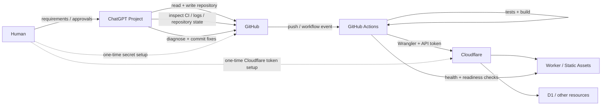
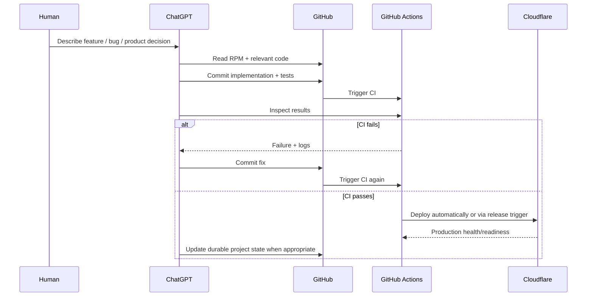

# ChatGPT + GitHub + Cloudflare Zero-Local Development Playbook

> A reusable workflow for building and shipping a web application from a ChatGPT Project without cloning the repository or running a local development environment.

## 1. What this workflow optimizes for

The goal is a project-development loop in which:

- the human creates the ChatGPT Project and an empty GitHub repository;
- ChatGPT treats GitHub as the canonical project filesystem and durable source of truth;
- ChatGPT writes code, tests, workflows, migrations, documentation, and project memory directly to GitHub;
- GitHub Actions provides the reproducible build/CI/deployment environment;
- Cloudflare provides the production runtime and stateful services such as Workers and D1;
- the human performs only the one-time security/authorization steps that should not be delegated to an assistant;
- after bootstrap, normal code changes can be tested and deployed without a local checkout.

This is **not** “ChatGPT editing a local repository through chat.” It is closer to an AI-native control plane in which the repository, CI system, and cloud runtime are the working environment.

## 2. The architecture



## 3. Responsibility boundary

### Human-only bootstrap actions

These steps intentionally remain human-controlled because they involve account ownership, authorization, billing, or secret material:

1. Create a **ChatGPT Project** and enable **project-only memory** when appropriate.
2. Add the project's persistent Instructions.
3. Create an empty GitHub repository.
4. Connect/authorize GitHub for ChatGPT.
5. Create the Cloudflare account/API token with least-privilege permissions.
6. Add Cloudflare credentials to GitHub Actions Secrets.
7. Configure custom domains, billing, external provider consoles, or other account-level settings when required.

Secrets should never be pasted into the chat.

### ChatGPT-owned work

After GitHub access is available, ChatGPT can own essentially the entire repository lifecycle:

- initialize the application;
- choose and document architecture;
- create source files;
- add dependencies;
- write tests;
- add D1 migrations;
- write Worker code;
- create CI workflows;
- create deployment workflows;
- update documentation;
- inspect GitHub Actions runs;
- read failure logs;
- commit fixes;
- maintain repository project memory;
- verify deployment health;
- continue iteration without requiring a local checkout.

### GitHub's role

GitHub is more than source control in this model. It is:

- the canonical project filesystem;
- the durable project history;
- the CI execution environment;
- the secret store for deployment credentials;
- the event source for automatic deployment.

### Cloudflare's role

Cloudflare is the production target:

- Workers execute server logic;
- Workers Static Assets serve the frontend;
- D1 stores relational state;
- other Cloudflare services can be added as required;
- Wrangler is invoked from GitHub Actions, not from the user's laptop.

## 4. Repository Project Memory (RPM)

Chat conversations are excellent working memory but should not be the canonical project state. Store durable state in the repository.

A minimal layout:

```text
.chatgpt/
├── project-memory.yaml
├── state.yaml
├── next-steps.md
└── decisions.md
```

Example manifest:

```yaml
version: 1
project:
  name: my-project
  repository: owner/my-project
canonical_source: github
files:
  state: .chatgpt/state.yaml
  next_steps: .chatgpt/next-steps.md
  decisions: .chatgpt/decisions.md
checkpoint:
  triggers:
    - checkpoint
    - save progress
    - 结束
    - 收尾
```

The Project Instructions should tell ChatGPT to read the RPM manifest and referenced files at the start of each substantive new conversation and to checkpoint when requested.

This makes the repository—not any individual chat—the durable project brain.

## 5. Standard project bootstrap

### Phase A — Human creates the control plane

1. Create a ChatGPT Project.
2. Enable project-only memory if isolation from other projects is desired.
3. Add project Instructions that define repository-first behavior and RPM rules.
4. Create an empty GitHub repository.
5. Give ChatGPT access to that repository.

No local clone is required.

### Phase B — ChatGPT initializes the repository

ChatGPT then:

1. initializes RPM;
2. scaffolds the application;
3. writes the initial architecture and decisions;
4. adds tests and CI;
5. adds Cloudflare configuration;
6. adds migrations and deployment workflow;
7. commits everything directly to GitHub;
8. monitors CI and fixes failures until green.

### Phase C — Human performs one-time production authorization

For the current Workers + D1 pattern, create a Cloudflare API token with least privilege, for example:

- Workers Scripts: Write/Edit
- D1: Write/Edit

Then add GitHub Actions repository secrets such as:

```text
CF_API_TOKEN
CF_ACCOUNT_ID
```

Application-specific integrations may require additional secrets, but they should be introduced only when actually needed.

### Phase D — First deployment

A bootstrap deployment workflow should be able to:

1. validate required secrets;
2. install dependencies;
3. run tests;
4. build production assets;
5. discover or provision the D1 database;
6. inject the D1 ID into the runner's temporary Wrangler configuration;
7. apply migrations;
8. deploy Worker and static assets;
9. discover the actual production URL;
10. call `/api/health` and `/api/ready`;
11. fail loudly if production is not healthy.

The important property is **idempotence**: re-running the deployment should reuse existing resources rather than create duplicates.

## 6. The normal development loop

After bootstrap, a normal iteration becomes:



The user's laptop does not participate in this loop.

## 7. Deployment modes

### Mode 1 — Manual production trigger

This is the safest bootstrap configuration and is what this project initially used:

```yaml
on:
  workflow_dispatch:
```

A human clicks **Run workflow** when ready.

Advantages:

- explicit production gate;
- useful while credentials and infrastructure are still being debugged;
- prevents accidental deploys during early repository construction.

Disadvantage:

- one manual click remains for every release.

### Mode 2 — Fully automatic deployment on `main`

For a small project where ChatGPT is allowed to commit directly to `main`, production can be completely automatic.

The simplest trigger is:

```yaml
on:
  push:
    branches:
      - main
  workflow_dispatch:
```

Then every commit ChatGPT writes to `main` launches deployment automatically. `workflow_dispatch` is retained as an emergency/manual re-run mechanism.

If the deploy workflow itself runs tests before deployment, this is already a valid CI/CD pipeline: a bad build will fail before Wrangler deploys it.

### Mode 3 — CI-gated automatic deployment (recommended reusable pattern)

For a cleaner separation of concerns:

1. `CI` runs on every change.
2. `Deploy` runs only after the `CI` workflow for `main` completes successfully.
3. Manual dispatch remains available for recovery.

Conceptually:

```yaml
on:
  workflow_run:
    workflows: [CI]
    types: [completed]
  workflow_dispatch:

jobs:
  deploy:
    if: >-
      github.event_name == 'workflow_dispatch' ||
      (github.event.workflow_run.conclusion == 'success' &&
       github.event.workflow_run.head_branch == 'main')
```

When implementing this pattern, the checkout step should deploy the exact SHA that passed CI rather than blindly checking out the newest `main` commit.

This gives a strong invariant:

> **Only a commit that passed CI can become production.**

## 8. Recommended automation policy

For small personal products and prototypes, the highest-leverage setup is:

```text
ChatGPT commit to main
        ↓
GitHub CI
        ↓ success only
Automatic Cloudflare Deploy
        ↓
Health + readiness checks
        ↓
Production
```

Keep `workflow_dispatch` as a fallback, but it should no longer be part of the normal release path.

For higher-risk production systems, switch to:

```text
ChatGPT creates branch/PR
        ↓
CI
        ↓
Human review / protected environment approval
        ↓
Deploy
```

The important point is that **manual release clicks are a policy choice, not a technical requirement**.

## 9. Secrets and security model

The flow is powerful because credentials do not have to pass through the conversation.

Recommended rules:

- use scoped Cloudflare API Tokens, never the Global API Key;
- grant only the services required by the project;
- store secrets only in GitHub Actions Secrets or an equivalent secret manager;
- never commit secrets to the repository;
- never paste secrets into ChatGPT;
- prefer account-specific resources over global permissions;
- give CI read-only GitHub permissions unless it needs more;
- keep deployment workflows version-controlled and reviewable;
- expose `/api/health` and, where useful, `/api/ready` so automation can verify real production state.

## 10. Cloud resource provisioning principle

Prefer **deployment-as-code** over dashboard-driven provisioning when the provider supports it.

For example, the deployment can:

```text
wrangler d1 list
       ↓ not found
wrangler d1 create
       ↓
wrangler d1 migrations apply
       ↓
wrangler deploy
```

This means a new project can be bootstrapped without the human manually reproducing resource settings in the Cloudflare dashboard.

Use dashboard steps only for actions that genuinely require account-owner intent, such as issuing a token or attaching a production domain.

## 11. Failure-recovery loop

A production failure should not turn into “download the repo and debug locally.”

The expected loop is:

1. ChatGPT reads the failed GitHub Actions job.
2. ChatGPT reads the detailed logs.
3. It determines whether the failure is:
   - code/build/test;
   - permissions;
   - missing secrets;
   - cloud provisioning;
   - migration;
   - routing/DNS;
   - health/readiness.
4. If it is a repository issue, ChatGPT commits a fix directly.
5. CI/deployment reruns.
6. If it is an account-level or secret problem, ChatGPT gives the human exact UI steps without asking them to touch local code.

This separation is important: **the human handles trust boundaries; ChatGPT handles implementation.**

## 12. A reusable Project Instructions template

The following is a compact starting point for future projects:

```text
This project uses GitHub as the canonical source of truth and RPM
(Repository Project Memory) for durable project state.

At the first substantive turn of every new conversation:
1. Access the project's GitHub repository.
2. Read .chatgpt/project-memory.yaml.
3. Load the state and next-steps files referenced by the manifest.
4. Read decisions and other RPM-managed files when relevant.
5. Treat repository state as canonical; chat is working memory only.

Do not require a local checkout when the task can be completed through GitHub.
Prefer creating/editing files, inspecting CI, and diagnosing workflow failures
through the connected GitHub repository.

Cloud deployment should run through version-controlled GitHub Actions.
Secrets must remain in GitHub/Cloud provider secret stores and must never be
requested in chat.

When I say checkpoint, save progress, 收尾, 结束, or equivalent, update RPM
before finishing.
```

Project-specific architecture, deployment provider, resource names, and safety constraints can be appended below this generic section.

## 13. Definition of Done for the pipeline itself

The development system—not just the application—is considered ready when:

- [ ] ChatGPT can read and write the repository without a local clone.
- [ ] RPM is initialized and repository-backed.
- [ ] CI runs automatically on repository changes.
- [ ] production credentials exist only in GitHub/provider secret stores.
- [ ] deployment is idempotent.
- [ ] database migrations run from CI/CD.
- [ ] deployed URL is discoverable by automation.
- [ ] health/readiness checks gate a successful deployment.
- [ ] a failed run can be diagnosed from GitHub Actions logs.
- [ ] normal production deployment requires no local commands.
- [ ] optionally, deployment runs automatically after CI passes on `main`.

## 14. Case study: `awesome-fame-slider`

This repository validated the workflow end to end:

1. the human created the empty GitHub repository;
2. ChatGPT initialized React/Vite/TypeScript, Worker code, D1 schema/migrations, tests, CI, deployment workflow, and RPM directly through GitHub;
3. no local project checkout was required;
4. the human created a least-privilege Cloudflare token and added GitHub Secrets following ChatGPT's UI instructions;
5. the first deployment automatically created `awesome-fame-slider-db`, applied all migrations, and created the `awesome-fame-slider` Worker;
6. when the first smoke test failed because of an unnecessary manually configured origin, ChatGPT read the Actions logs, removed that configuration dependency, committed the fix, and verified CI;
7. the second deployment completed successfully, including `/api/health` and `/api/ready`;
8. production became available at the Worker URL without any local terminal operation.

The remaining manual **Run workflow** click is not technically required. It exists because the current Deploy workflow uses `workflow_dispatch` as its trigger. Replacing or supplementing that trigger with CI-gated deployment turns the process into a fully automatic GitHub-to-Cloudflare delivery loop.

## 15. The resulting mental model

Traditional small-project workflow:

```text
Chat → copy code → laptop → editor → terminal → git → GitHub → cloud dashboard
```

AI-native repository workflow:

```text
Human intent
    ↓
ChatGPT Project + RPM
    ↓
GitHub repository
    ↓
GitHub Actions
    ↓
Cloudflare
```

The laptop becomes optional. The durable artifacts are the repository, its workflows, its project memory, and the deployed cloud resources.
